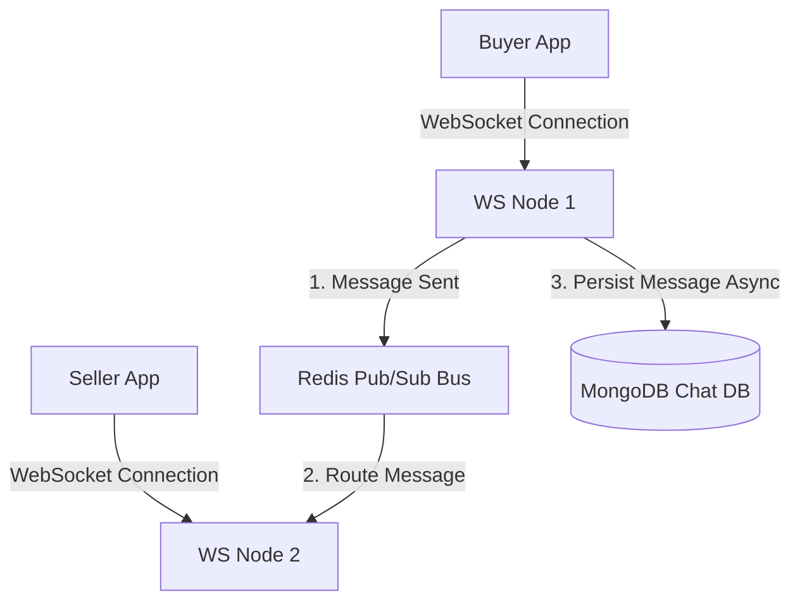

# Real-Time Chat System Architecture - Shopee Clone

This document details the instant messaging (IM) system between buyers and sellers.



## 1. Connection & Routing Mechanism
- **WebSocket Protocol**: `/api/v1/chat/ws` handles WebSocket upgrades.
- **Node Scale-Out via Redis Pub/Sub**: 
  - WS nodes are stateless. If Buyer is connected to Node 1, and Seller is connected to Node 2:
  - Node 1 publishes the chat payload to Redis channel `user:chat:{sellerId}`.
  - Node 2 (which is subscribed to the channel) receives the message and pushes it down Seller's active WebSocket connection.

## 2. Database Model: MongoDB
Use MongoDB for storing highly concurrent, dynamic message lists.

### Collection: `chat_messages`
```json
{
  "_id": "ObjectId",
  "room_id": "string",
  "sender_id": "uuid",
  "receiver_id": "uuid",
  "message_type": "text | image | product_card",
  "content": "string",
  "is_read": "boolean",
  "created_at": "date"
}
```
**Index Required**:
```sql
db.chat_messages.createIndex({ room_id: 1, created_at: -1 });
```
