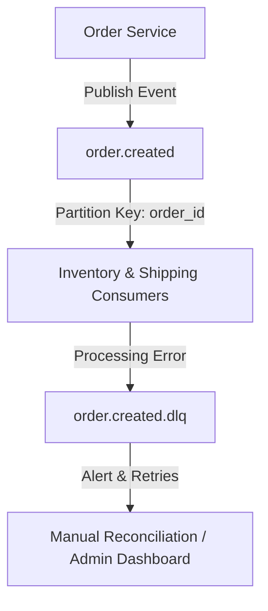

# Kafka Topology & Reliable Delivery Systems

Ensuring robust message streaming and eventual consistency.

## 1. Kafka Topic Configuration
- **Replication Factor**: **3** (requires minimum 3 Kafka brokers in production to ensure zero data loss).
- **Min In-Sync Replicas (min.insync.replicas)**: **2**.
- **Acks Standard**: `acks=all` (ensures event is committed to all in-sync replicas before returning success).

## 2. Dead Letter Queue (DLQ) Strategy
- If a consumer fails to process a message due to a database outage:
  1. Retry **3 times** with exponential backoff.
  2. If still failing, publish the failed event payload to `{topic_name}.dlq` along with the exception stack trace appended in the Kafka header metadata.
  3. Raise alarms to Grafana alert channels for operations review.
