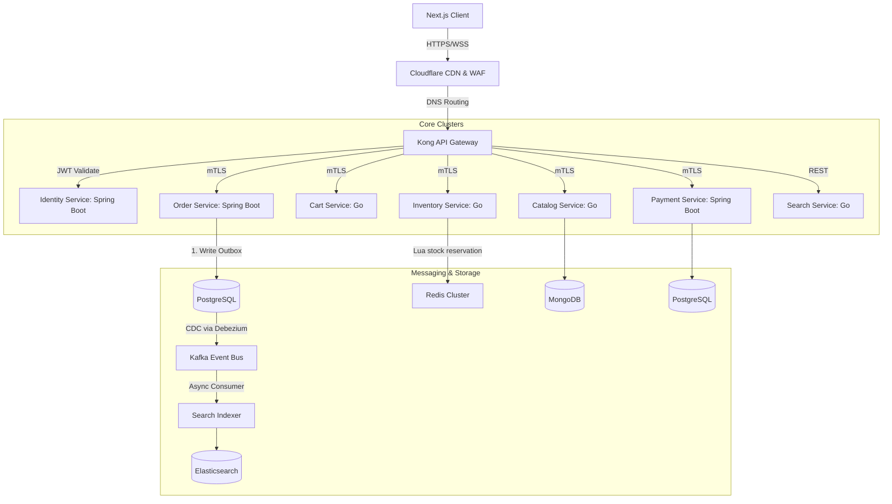

# System Topology - Tiki Clone Enterprise

This system leverages high-concurrency microservices designed to scale independently.

## Transaction Lifecycle (Search to Order Complete)
1. **Browse**: User searches products via `/api/v1/search` resolved instantly via **Elasticsearch** (read-optimized replica).
2. **Add to Cart**: `/api/v1/cart` checks variations and locks active items in **Redis memory store** (latency < 2ms).
3. **Checkout Submit**:
   - `/api/v1/checkout` coordinates with **Inventory** using high-concurrency **Redis Lua Stock reservation**.
   - If stock is locked successfully, Order transitions to `PENDING_PAYMENT` and triggers Payment transaction.
   - Payment webhooks complete, raising `payment.completed` event to finalize order shipping.
