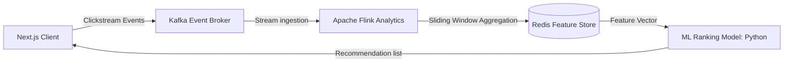

# Recommendation Engine clickstream & Processing Pipeline

The personalized recommendation module increases session duration and Conversion Rates.

## Apache Flink clickstream Aggregation
- Flink reads click/view counts across a 5-minute sliding window to identify trending SKU groups.
- Product listings retrieve these scores to adjust the ranking of user homepages dynamically.
