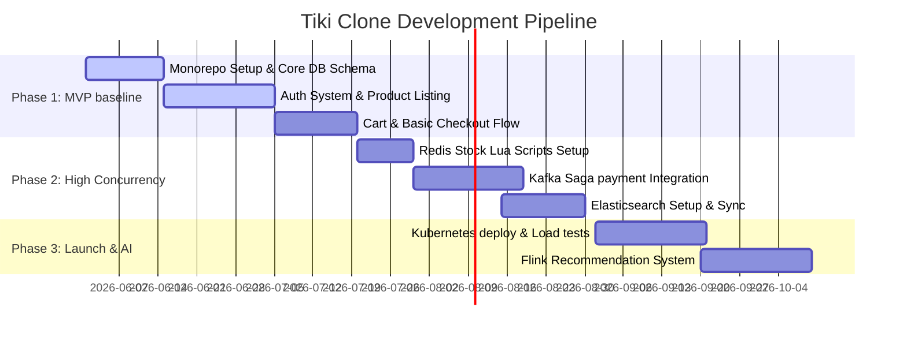

# Phased Product Roadmap

A 6-month product development timeline for launching the Tiki Clone platform.

```mermaid
gantt
    title Tiki Clone Development Pipeline
    dateFormat  YYYY-MM-DD
    section Phase 1: MVP baseline
    Monorepo Setup & Core DB Schema: active, 2026-06-01, 14d
    Auth System & Product Listing   : active, 2026-06-15, 20d
    Cart & Basic Checkout Flow     : 2026-07-05, 15d
    section Phase 2: High Concurrency
    Redis Stock Lua Scripts Setup   : 2026-07-20, 10d
    Kafka Saga payment Integration : 2026-07-30, 20d
    Elasticsearch Setup & Sync      : 2026-08-15, 15d
    section Phase 3: Launch & AI
    Kubernetes deploy & Load tests : 2026-09-01, 20d
    Flink Recommendation System     : 2026-09-20, 20d
```
